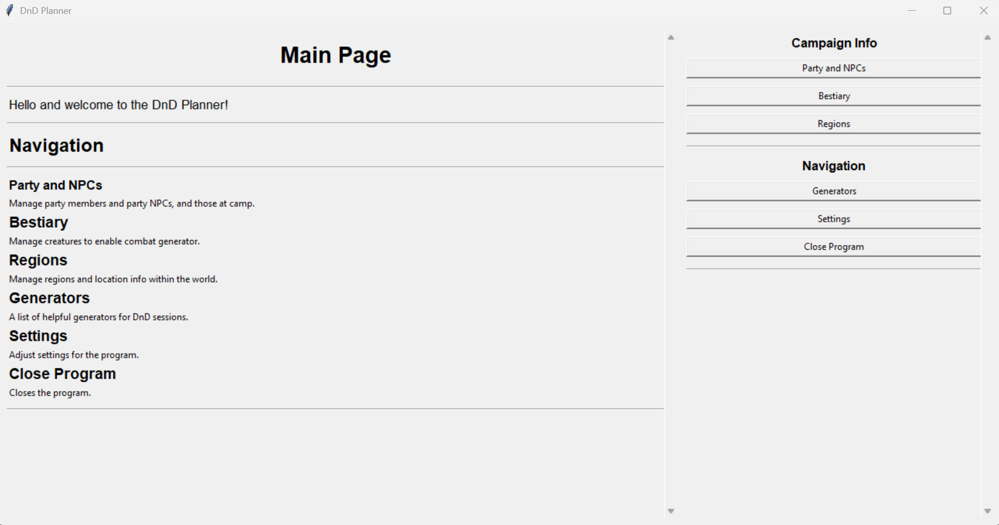

# DnD Planner

A **Python 3 Tkinter-based application** for managing and planning **Dungeons & Dragons campaigns**.  

Manage your party, NPCs, bestiary, regions, and generate loot or encounters. The program dynamically adapts as more data is entered and stores all information in JSON files.

---

## Features

### Party Management
- Input and manage player data.  
- Automatically calculates **estimated party strength**.  
- Keep track of party members and their stats.

### Bestiary
- Input and manage enemy/monster data.  
- Generate **balanced encounters** based on party strength.  
- Stores all enemies in JSON for future reference.

### Loot Generators
- Generate treasure and loot for encounters or campaigns.  
- Loot tables can be customized and extended.

### Region Management
- Input and manage location and region data.  
- Build interconnected locations with NPCs and encounters.  
- Program updates JSON data dynamically as regions are expanded.

### Data Persistence
- All information is stored in JSON files under the `jsons/` folder.  
- Program adapts as data is added, making it easy to continue campaigns over multiple sessions.

---

## Installation & Usage

### Option 1: Download Pre-Built EXE (Windows)
1. Go to the [Releases page](https://github.com/username/dnd_planner/releases/latest) on GitHub.  
2. Download the latest `DnD Planner.exe`.  
3. Place the EXE anywhere on your system and **double-click** to launch.  

_No Python installation required._

---

### Option 2: Build from Source
Requires **Python 3.11+** and [PyInstaller](https://www.pyinstaller.org/).

```powershell
git clone https://github.com/username/dnd_planner.git
cd dnd_planner

# Create and activate virtual environment
py -m venv .venv
.\.venv\Scripts\Activate.ps1

# Install dependencies
pip install pyinstaller

# Build executable
pyinstaller --onefile --windowed --add-data "jsons;jsons" main.py
```

- After building, the executable will appear in the `dist/` folder.  
- You can rename it (e.g., `DnD Planner.exe`) and move it anywhere.  
- Run it to launch the program — all JSON data is bundled inside.

---

## Requirements
- Python 3.11+ (for building from source)  
- Tkinter (included with Python standard library)  

---

## Screenshots




```markdown


```

## Contributing

Feel free to submit issues or pull requests.

Please follow PEP8 conventions when contributing Python code.
